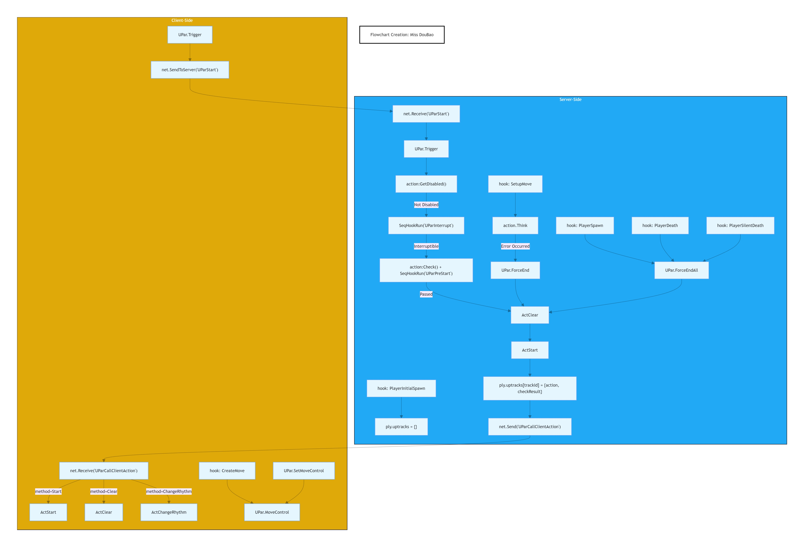

<p align="center">
  <a href="./README_en.md">English</a> |
  <a href="./README.md">简体中文</a>
</p>

## Table of Contents

<a href="./UPACTION_en.md">UPAction</a>  
<a href="./UPEFFECT_en.md">UPEffect</a>  
<a href="./SERHOOK_en.md">SeqHook</a>  
<a href="./HOOK_en.md">Hook</a>  
<a href="./LIFECYCLE_en.md">Lifecycle</a>  
<a href="./LRU_en.md">LRU</a>  
<a href="./CUSTOMEFFECT_en.md">Custom Effect</a>  

# About Lifecycle
**UPAction.TrackId**
```note
This is the core parameter.
- If actions are on the same track, an interruption will be called. For example, if a vault check is called while climbing is in progress, the interruption process will be initiated.
- If actions are on different TrackIds (e.g., an inspection action), they can run in parallel with climbing or vaulting.
```



